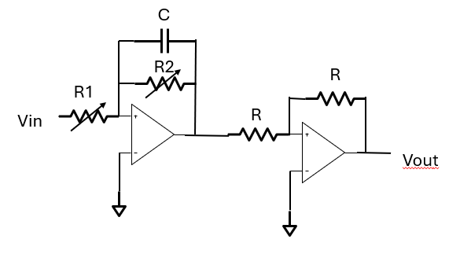
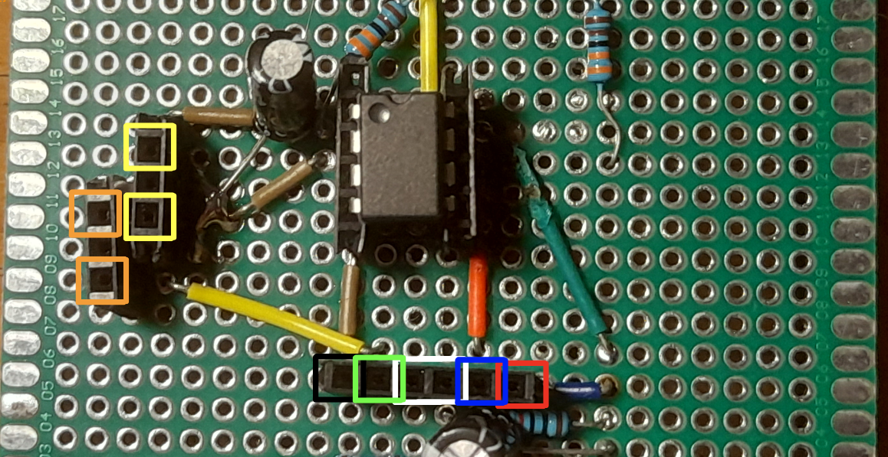

# System Emulator
This is an analog system emulator for 1st order LTI dynamical systems. It consists of an integrator circuit in series with an inverting amplifier. The circuit makes use of LM358N operational amplifier, as well as two potentiometers. One of these allows one to set the system's gain, while the other one can be used to change the pole's location (although it influences the gain as well). A virtual ground circuit is used to power the LM358N. 

# Circuit schematic

# Circuit transfer function
The system's transfer function is given by: 

$$\frac{V_{out}(s)}{V_{in}(s)} = \frac{R_2}{R_1}(\frac{R_2}{R_2Cs+1})$$

where $R_1$ and $R_2$ can be set by the user.

# Board layout
The circuit was soldered and tested on a perfboard:

Here is a zoom in:

Legend:
- **Black**: - $V_{cc}$ (power supply GND)
- **Red**: + $V_{cc}$
- **White**: Virtual ground (GND)
- **Green**: Input voltage (w.r.t. virtual ground)
- **Blue**: Output voltage (w.r.t. virtual ground)
- **Orange**: Gain potentiometer pins
- **Yellow**: Pole potentiometer pins
 
# Licence
This project is licenced under the [CERN Open Hardware Licence Version 2 - Permissive](https://choosealicense.com/licenses/cern-ohl-p-2.0/#).
